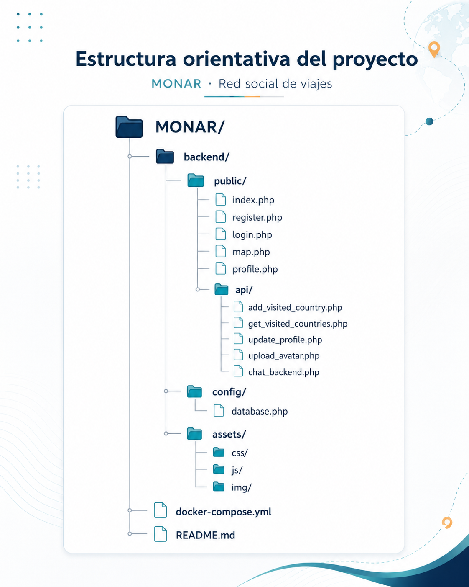
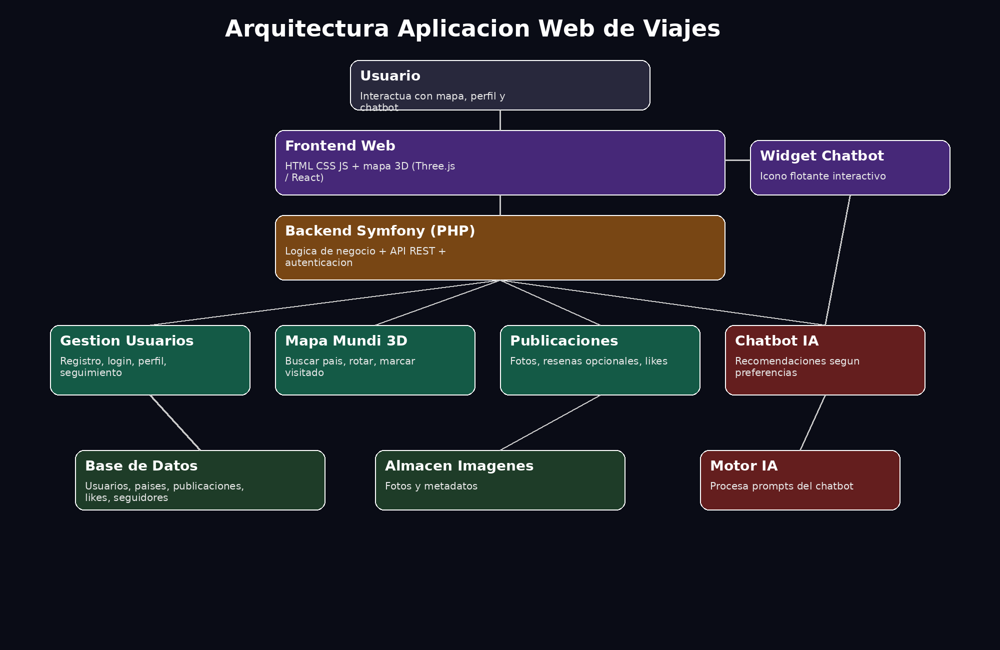

# MONUAR

Red social de viajes y registro visual de paises visitados. Proyecto de Fin de Grado del ciclo de Desarrollo de Aplicaciones Web (DAW), realizado por Anouar y Moises.

MONUAR permite crear una cuenta, marcar paises visitados sobre un globo 3D, consultar el progreso personal y gestionar un perfil. Tambien incorpora publicaciones, fotografias, resenas, seguidores y un asistente de viajes.

## Para verlo en local

Necesitas tener instalado:

- PHP 8.4 o superior
- Composer
- MySQL 8 
- Un navegador web

Puedes usar XAMPP para PHP y MySQL, o Docker Desktop para levantar los servicios en contenedores.

### Con XAMPP o MySQL local

```bash
git clone https://github.com/moisessanchezsantos/TFG-Monuar.git
cd TFG-Monuar/backend
composer install
copy .env.example .env
php bin/console doctrine:database:create --if-not-exists
php bin/console doctrine:migrations:migrate --no-interaction
php -S 127.0.0.1:8000 -t public
```

Abre http://127.0.0.1:8000 en el navegador. En Windows, `copy` es el equivalente de `cp`.

### Con Docker

Con Docker Desktop abierto:

```bash
docker compose up --build
```

Abre http://127.0.0.1:8080.

## Funcionalidades

- Registro, inicio y cierre de sesion.
- Perfil personal con avatar, biografia y estadisticas.
- Mapa mundial interactivo en 3D.
- Busqueda y seleccion de paises.
- Registro persistente de paises visitados.
- Publicaciones, fotografias, resenas y valoraciones.
- Sistema de seguidores.
- Panel de administracion.
- API interna con respuestas JSON.
- Chatbot de viajes conectado con Ollama y RestCountries API.
- Validacion de formularios, contrasenas y archivos subidos.
- Interfaz adaptable a ordenador, tablet y movil.

## Tecnologias

PHP 8.4, Symfony 8, Doctrine ORM, MySQL/MariaDB, Twig, HTML5, CSS3, JavaScript, Fetch API, Globe.gl, WebGL, Stimulus, Turbo, Ollama, RestCountries API y Docker.

## Estructura

```text
.
├── backend/
│   ├── assets/
│   ├── config/
│   ├── migrations/
│   ├── public/          # Paginas, API, CSS, JavaScript e imagenes
│   ├── src/
│   ├── templates/
│   ├── composer.json
│   └── .env.example
├── database/
├── docs/
├── docker-compose.yml
└── arquitectura.png
```

## Capturas

### Pantalla de inicio


### Interfaz del proyecto


### Estructura del proyecto



### Arquitectura



## Documentacion del TFG

- [Memoria completa del proyecto](docs/monar/MEMORIA-MONAR.pdf)
- [Presentacion y defensa](docs/monar/DEFENSA-MONAR.pdf)
- [Documentacion de actualizaciones](docs/monar/ACTUALIZACION.md)

## Seguridad y datos

El repositorio no incluye archivos `.env` reales, contrasenas, claves privadas ni copias de la base de datos. `.env.example` contiene valores de referencia para desarrollo local. Antes de un despliegue real hay que configurar secretos, HTTPS, una base de datos gestionada y almacenamiento seguro para archivos subidos.

## Despliegue

MONUAR necesita PHP, Symfony y MySQL/MariaDB, por lo que no es una web estatica para Vercel. Para una demo publica se recomienda un servicio compatible con PHP y base de datos, o publicar el repositorio junto con estas capturas en el portfolio.

## Estado

Proyecto academico completo y en evolucion. La aplicacion se ha desarrollado como trabajo de fin de grado y documenta analisis, diseno, desarrollo, pruebas, arquitectura y futuras mejoras.

## Autor

Moises Sanchez Santos  
[GitHub](https://github.com/moisessanchezsantos)
